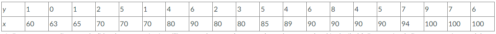
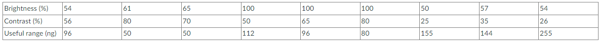

## Question 1

<div style="text-align: Justify"> An article in the *Journal of Sound and Vibration* ["Measurement of Noise-Evoked Blood Pressure by Means of Averaging Method: Relation between Blood Pressure Rise and *PSL*" (1991, Vol. 151(3), pp. 383-394)] described a study investigating the relationship between noise exposure and hypertension. The following data are representative of those reported in the article.

<center>



</center>

**A. Draw a scatter diagram of y (blood pressure rise in millimeters of mercury) versus x (sound pressure level in decibels). Does a simple linear regression model seem reasonable in this situation?**

For a scatter diagram to be drawn, the given raw data must be stored in a variable as follows: </div>

```{r}
SoundPressure = c(60, 63, 65, 70, 70, 70, 80, 90, 80, 80, 85, 89, 90, 90, 90, 90, 94, 100, 100, 100)
BloodPressureRise = c(1, 0, 1, 2, 5, 1, 4, 6, 2, 3, 5, 4, 6, 8, 4, 5, 7, 9, 7, 6)
```

A scatter diagram can be made by using:

```{r fig.align = 'center'}
plot(SoundPressure, BloodPressureRise,
     main = "Scatter Diagram of Sound Pressure Level vs. Blood Pressure Rise",
     xlab = "Sound Pressure (dB)",
     ylab = "Blood Pressure Rise (mmHg)", las = 1)
```

<div style="text-align: Justify"> Based on the scatter diagram above, it seems that Blood Pressure Rise also increases as Sound Pressure increases. The scatter plot follow a straight incline pattern going upward. **It seems reasonable to create a simple linear regression model for this diagram.**

***

**B. Fit the simple linear regression model using least squares. Find an estimate of $\sigma^2$**

A simple linear regression in the form $Y=\hat\beta_0+\hat\beta_1x$ can fit the data. In this problem, $Y$ represents Blood Pressure Rise while $x$ represents Sound Pressure.

A simple linear regression model can be fitted by using: </div>

```{r echo=1:2}
simreg = lm(BloodPressureRise ~ SoundPressure)
summary(simreg)
coeffsim = coef(simreg)
```

<div style="text-align: Justify"> From the information above, the least squares estimates of the slope and intercept are `r coeffsim[2]` and `r coeffsim[1]`, respectively. Therefore, a fitting model for the data is **$Y=$ `r coeffsim[1]` $+$ `r coeffsim[2]`$x$.**

To estimate $\sigma^2$, the equation below will be used: </div>

$$
\sigma^2=\frac{\Sigma^n_{i=1}e^2_i}{n-2}
$$

But it can easily be solved by utilizing code chunks:
```{r}
var1 = (deviance(simreg))/simreg$df.residual; var1
```

***

<div style="text-align: Justify"> **C. Find the predicted mean rise in blood pressure level associated with a sound pressure level of 85 decibels.**

To find the predicted mean rise in blood pressure level, the equation formed $Y=-10.1315377+0.1742939x$ will be used where, $x=85$. Although, code chunks can also be used. </div>

```{r}
prediction = data.frame(SoundPressure=85)
predictbp = predict(simreg, prediction)
```

**$\therefore$ The predicted mean rise in blood pressure level is `r predictbp`**

## Question 2

<div style="text-align: Justify"> An article in *Optical Engineering* ["Operating Curve Extraction of a Correlator's Filter" (2004, Vol. 43, pp. 2775-2779)] reported on the use of an optical correlator to perform an experiment by varying brightness and contrast. The resulting modulation is characterized by the useful range of gray levels. The data follow:

<center>



</center>

**A. Fit a multiple linear regression model to these data.**

Input the raw data into a data frame as follows: </div>

```{r}
optics.data <- data.frame(
  Brightness = c(54, 61, 65, 100, 100, 100, 50, 57, 54),
  Contrast = c(56, 80, 70, 50, 65, 80, 25, 35, 26),
  UsefulRange = c(96, 50, 50, 112, 96, 80, 155, 144, 255)
)
```

<div style="text-align: Justify"> Note that there are two variables and thus a multiple linear regression in the form $Y=\hat\beta_0 + \hat\beta_1x_1 + \hat\beta_2 x_2$ can fit the data. In this context, the variables $Y$ represents for the useful range, $x_1$ represent the brightness, and $x_2$ represent the contrast.

Fit a multiple linear regression model by using: </div>

```{r echo=1:2}
multreg <- lm(UsefulRange ~ Brightness + Contrast ,data=optics.data)
summary(multreg)
coeffsmult = coefficients(multreg)
```

<div style="text-align: Justify"> From the results above, a fitting model for the data is **$Y=$ `r coeffsmult[1]` + `r coeffsmult[2]`$x_1$ `r coeffsmult[3]` $x_2$.**

***

**B. Estimate $\sigma^2$.**

To estimate $\sigma^2$, we will use the formula: </div>

$$
\displaystyle \dfrac{\Sigma_{i=1}^{n} e_i^2}{n-p}
$$

To compute that, the code will be used is:

```{r}
var2 = (deviance(multreg))/multreg$df.residual; var2
```

**Thus, the estimated value of $\sigma^2$ is `r var2`**

***

**C. Compute the standard errors of the regression coefficients.**

```{r include=FALSE}
secoeff = coef(summary(multreg))[, "Std. Error"]
```

<div style="text-align: Justify"> The standard errors of the regression coefficients are found in the summary table above under the `Std. Error` column. Specifically, the standard errors for each coefficient are: </div>

- $se(\hat{\beta_0})$ = `r secoeff[1]`
- $se(\hat{\beta_1})$ = `r secoeff[2]`
- $se(\hat{\beta_2})$ = `r secoeff[3]`

***

**D. Predict the useful range when brightness = 80 and contrast = 75.**

To predict the useful range with brightness of 80% and contrast of 75%, the code chunk will be utilized:

```{r}
newdata = data.frame(Brightness=80, Contrast=75);
predict(multreg, newdata)
```

**Thus, using the fitted multiple linear model, the predicted value obtained is `r predict(multreg, newdata)`.**

***

**E. Test for significance of regression using $\alpha=0.05$. What is the P-value for this test?**

To test the significance of regression with $\alpha=0.05$, the hypothesis are:

- $H_0: \beta_1 = \beta_2 = 0$
- $H_1: \beta_j \neq 0$ for at least one $j$

<div style="text-align: Justify"> The test statistic is $f_0=$ `r summary(multreg)$fstatistic[1]`. 
Since $f_0 >f_{0.05,2,6}=$ `r qf(0.05, 2, 6, lower.tail=F)`, the null hypothesis is rejected on $\alpha=0.05$ with a ***P*-value of `r pf(summary(multreg)$fstatistic[1],2,6, lower.tail=F)`.**

**In conclusion, at least one of the regressor variables, either brightness or contrast, or both, contribute significantly to the fitted model.** </div>

***

<div style="text-align: Justify"> **F. Construct a t-test on each regression coefficient. What conclusions can you draw about the variables in this model? Use $\alpha=0.05$.**

The three pairs of hypotheses cosntructed for each regression coefficient $\beta_0,\beta_1,\beta_2$ are as follows: </div>

- $H_0: \beta_0 =0, \beta_1 =0, \beta_2 =0$
- $H_1: \beta_0 \neq0, \beta_1 \neq0, \beta_2 \neq0$


```{r include=FALSE}
tcoeff = coef(summary(multreg))[, "t value"]
```

<div style="text-align: Justify"> The test statistics for each regression coefficient are also shown in the summary table above under the `t value` column. Specifically, the test statistic of each coefficients are: </div>

- $t_{0, \beta0} =$ `r tcoeff[1]`
- $t_{0, \beta1} =$ `r tcoeff[2]`
- $t_{0, \beta2} =$ `r tcoeff[3]`

The rejection region for all of the test statistic is $|t_0|>$ `r qt(0.025, 22, lower.tail=F)` with $\alpha=0.05$. 

<div style="text-align: Justify"> Since the test statistics $t_{0, \beta0}$ and $t_{0, \beta2}$ are found in the critical region, the hypotheses $\beta_0=0$ and $\beta_2=0$ are rejected. This concludes that the variable $x_2$, which is contrast in this context, contributes significantly to the model. However, the hypothesis $\beta_1=0$ fails to be rejected at $\alpha=0.05$. This implies that there is insufficient evidence to say that the variable $x_1$ or brightness contributes significantly to the model. </div>

## References

- D. C. Montgomery and G. C. Runger, Applied statistics and probability for engineers. New York: Wiley, 2003.